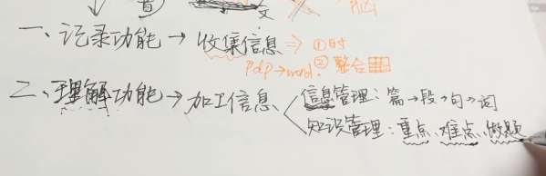
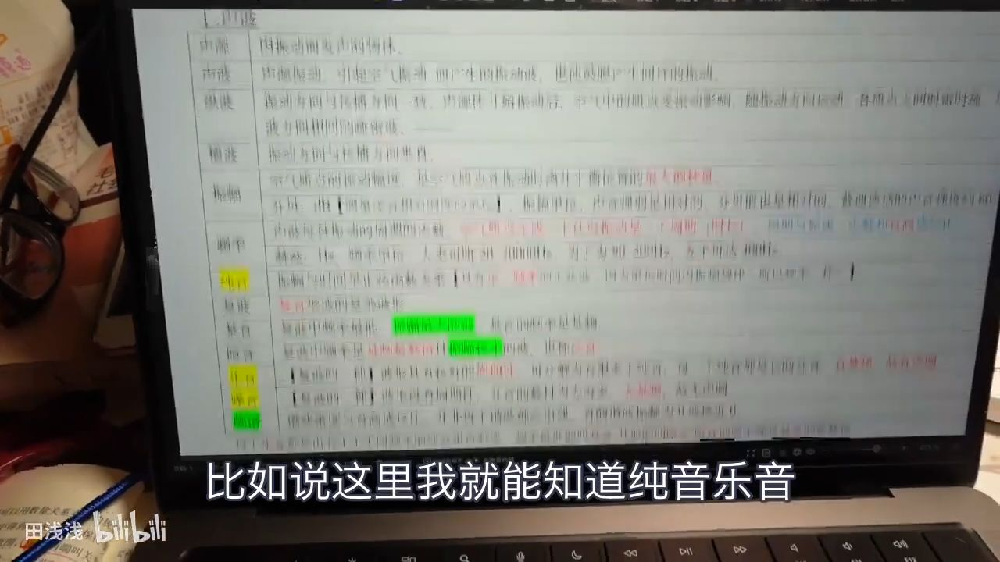

# 停止摆烂！

每天一遍摆烂再见，4个方法快速进入学习状态！

## 一、停止自责、停止过度担忧

1.告诉自己大多数情况下，压垮你的并不是事情本身，而是你的**情绪**。

2.内耗就是**自己和自己斗争**。

3.请给自己正向的心理暗示，反正消极改变不了现状，不如去**试一试**，万一做成了，自己太厉害了;万一没成功，自己努力过了，至少不会后悔。

4.逆袭的人那么多，**凭什么不能是你**。

## 二、  五秒法则

1.适合**拖延症晚期**的同学。

2.很多事做起来还好，就是**开始太难了**！

3.每一次你有什么想做的事，倒数5秒54321，马上行动，**不要留给自己纠结犹豫的时间**。

比如，早上起床应该在第一个闹钟响后，马上54321然后起床！

简单粗暴又有效！

## 三、把想做的事情具体化

焦虑的反义词是具体！

1.把要做的事情**写下来**，然后**一步一步的去执行它**。把事情**分步骤执行**，就会感觉到具体而充实。

2.比如面临很重要的考试，

第一步:买书。买什么书？买什么资料？画多少钱？

第二步上课。上什么课？上谁的课？上多久？

第三步，做题。做真题还是模拟题？买哪种题？

然后一步一步的去执行它。

## 四、改变环境

在学校就去图书馆、自习室，把书桌全部整理出来。

努力的过程一定是**孤独**的，如果你想要得到你想要的，就注定要经过一段**沉默黑暗的时光**。

要学会马上行动、延迟满足、进入良性循环。

时间就是最公平的东西。

重新出发这件事，任何时候都不迟。

点个赞写下你的目标，明天又是全新的一天！

# 高效学习！

## 1.取势篇

学习的取势，要抓住两点：

第一个是**学习的目的**

第二个是所学**内容的本质规律**。

抓住这两个核心，针对性的投入精力，我们就能像风口上的猪一样，事半功倍。

### 1.目的

#### **1.明确目的**

* 1.只有**明确了目的**，也就是你学这个东西，是为了**解决什么问题**？你才有可能知道，我们要学什么？应该学到什么程度？

* 2.要**达到这个目的**，并不需要透彻掌握所有知识点。都看一遍先。总结出来，考察重点是什么，对应什么章节。必考的，就重点去看。细枝末节，就快速略过。用**最少的时间**，复习**最多的重点内容**，这就是根据目的，抓大放小。

####  **2.学习本质**

> **除了明确学习的目的，我们还要明白，所学内容的本质，才能把效率提到最高。**

> **这个本质，其实就是某个学科，考察什么能力。对成年人来说，本质就是行业规律。**

 

虽然说，**自己思考**，也能归纳出本质，但是这样太慢了。我给你一条捷径：

在学习之前，你可以先把网上牛人，**总结的本质**都看一遍先。

有些时候，你学不好，并不是因为你学习能力差，或者不努力。而是你连**学科本质都不知道**

#### **3.取势实操**

> **想要在学习中取势，就必须时刻知道，我们学习的目的，以及学习内容的本质规律**

1.在学习前，你要先借鉴网络大神，大致搞懂本质

2.切记，在学一个章节前，千万不要急着去看课本。要先快速去看，习题册中这个章节的习题。你甚至可以直接看答案。每道题就用1分钟。看不懂是正常的。这一步，主要是记录答案中，经常出现的，关键术语、关键解题步骤、关键知识点的推理过程。带着这3个关键，开始去看书。

3.经过了前一步，你就知道，书中有什么是重点的，常考的；什么是没用的，边边角角的。着重看刚才记下来的重点部分，这样你看书就比别人快了不止1倍。

 

 

d看完书后，再去做章节的例题，以及老师给你的习题册。如果你想了5分钟还卡壳的话，果断去搜答案。并且，在自己的笔记本上，把自己卡壳的原因，还有对应的解题步骤，记录下来。这是积累自己的解题套路。

 

经过这四步，你的看书速度，是别人的2倍，接触题目的数量，也是别人的2倍。算下来，总共就是其他同学们的4倍。于是你就能赢4次，把同学们摁在地上摩擦4次...

所以，这个方法就叫做四赢法。

 

其实，四赢法还不是终点。学长自己在用的，是64赢法。不过由于太过干货，这里就不放出来了...老规矩，点赞收藏破70000，我就分享出来吧...

 

二、明道篇

当我们在学习之前取好势了，那在开始学习后，就要开始明道了。这里就是今天第二个重点，明道篇。

所谓学习的明道，就是指，我们要知道，学习是遵循什么科学规律的。这里的道，就是规律。

先问大家一个问题，你年级里面，成绩最好的那个同学，是不是永远都最刻苦、最用功的那个呢？

其实仔细想想，往往那个人，并不是最刻苦的。

之所以会这样，是因为学神在学习的时候，会更加关心，方法是否科学，而不只是，投入了多少时间。

学习总共分为三个层次：记忆、理解、运用。

这一篇，学长会告诉你这3者的规律，让你像学神一样，学得又快又好。

 

 

01

记忆的道

 

a纯记忆的核心规律，就是重复频率

 

从原理上来说，记忆就是神经元之间的连接。当你背诵的频率，达到了一定的阈值，这些突触链接就会增强，变得容易被激发，于是就形成了记忆。

 

举个最简单的例子，说到58同城你马上想到杨幂，说到铂爵旅拍，你马上想到郭碧婷。广告虽然看起来挺low的，但是你就是记住了。

这两个广告，就是跟洗脑一样，不停地重复几句话。当你听广告词的频率足够了，就自然记住了。

这也是为什么，这种重复喊口号的广告越来越多了，因为有效果呀。恰饭嘛，不寒碜。

 

所以，想要形成纯记忆，你只需要不断重复，提高频率。无意识中，大脑就能帮你记住了。

但有些同学，是察觉不到这个点的。你背书的时候，会不会这个样子：

背课本上的3段话，就一个字一个字地背。你用眼睛杀气腾腾地死盯着，觉得盯的越认真，越记得牢。如果你的眼睛是放大镜，说不定这本书都已经烧起来了。

看似很认真，但是你在一句话上能卡很久，总体重复频率是很低的，所以就死活背不下来。

 

b记忆的正确方法

正确的背书方法，应该是抓住重复频率：

你可以先放轻松地，把这3段话看一遍。一边看，一边挑出关键词和关键句子，认真地再看一遍。然后回到第一段话，再刷4遍，对第二第三段话，也是同样方法。刷的同时，遇到关键词和关键句子，要单独多看2遍。

 

这么下来，每个句子，你都已经重复了6遍了。对于关键句子，也重复了8遍。只要你考试的时候，不要求一字不漏地默写，这么几遍就足够形成短期记忆了。

 

总结一下，我们记忆的时候，千万不要苛责自己，要求一次就背下来，一旦记不住，还贬低自己。正确的方法是，让自己放松一点，哪怕每一次背的时候不太认真，只要重复频率上来了，你的大脑，就能自动帮你记下来。

 

c记忆的注意事项

有些人可能会说，自己就是这样背的，但还是记不住。那是因为你没有意识到（承接后面，不然会走神）

在记忆的时候，神经元也是会疲劳的。如果一次性大量地背，虽然重复频率达到了，但是神经元负担过重，记忆的效果是会递减的。

 

1）分散记忆，省时省力

所以，你要分散记忆，才能省时省力。这在长期记忆的时候，会尤其明显。

你有没有发现，你期末考前临急抱佛脚，背了大量知识，一考完就马上忘了。而学神却像个无情的固态硬盘，哪怕你在年初一晚上摇醒他，他也仍然可以对答如流。

 

这就是因为，你没有分散记忆。学神是每天背一点，而你是集中大量背。哪怕你们的重复次数是一样的，但是由于神经元太疲劳了，所以长期记忆效果，就比不上学神。

 

2）交替记忆，提高效率

其次，你还可以交替记忆。比如背一个科目，超过一个半小时了，就切换到另外一科。不同科目用到的神经元是不一样的。交替背诵，可以让一部分神经元，有机会休息。这样记忆的效率，才会最高。

 

3）不要迷信艾宾浩斯

关于长期记忆，还有一个必跳大坑。那就是艾宾浩斯曲线。我在以前的视频已经详细说过了，这里就不多说了。你们可以去看置顶评论。

 

 

02

理解的道

 

a什么是理解？

我先问你一个问题哈。你知道什么是理解吗？

从小到大，老师告诉你，听完要理解。但是从来没有人告诉过你，理解到底是什么意思。

于是你就只能自己摸索，似乎上上课、刷刷题，就无缘无故理解了。像是在搞玄学似的。

其实这些想法都是错的。

所谓理解，就是联系。

理解的规律，就是建立联系。

这种联系，有两种。

 

第一种是

1）抽象概念，和实际例子的联系

比如罗翔老师跟你说，法外狂徒这个抽象概念。如果你能马上想到，自己强奸了自己的张三，这个实际例子，那你就真的理解这个成语了。

 

再比如，你去学勾股定理。有些人都是硬记公式，什么c²=a²+b²，c=（根号）a²+b²，然后拿笔记本，把公式抄个十几次。其实这是在浪费时间。真正理解勾股定理，就是看到这个词，马上在大脑中想出一个三角形，知道哪条边是直角边，哪条是斜边。直角边的平方相加，就等于斜边的平方了。

 

所以，理解的第一步，就是给抽象概念，联系上实际例子。

 

2）抽象概念之间的联系

但是，光有抽象概念和实际例子的联系，还是不够的。这时候，大脑中的知识还是孤立的，运用的时候仍然用不出来，算不上真理解。

 

只有在不同抽象概念之间，也建立起联系，这才是真理解。

比如，你理解了电流，这个抽象概念，以及电压，这个抽象概念。如果题目中已知了I、U的大小，你能马上条件反射地想起来，可以通过U=IR这个联系，求出电阻。这时候，你才真正理解了，电路中的物理关系。

对于那些，看到IU，就联想到韩国女明星的同学，虽然你的理解能力很强，但是学长建议你，自己去面壁思过一下。

 

总结一下，理解的本质，就是构建起，抽象概念和实际例子之间的联系，以及概念相互之间的联系。

 

b怎么理解？

那怎么样去做，才能做到理解呢？

我直接告诉你实操指南。

i）你挑出同一章节，需要去理解的重点概念。多看几遍，先记下来。哪怕是死记硬背，也没关系。

ii）找到一大堆，用了某个概念的简单题答案。这些题目，其实就是把抽象概念，运用到实际生活中的例子了。重点观察，这个疑惑的概念，在具体的场景中，是长什么样子的。

iii）等你看得够多了，就会无缘无故有一种，“oh， so thus 咧”，的感觉。这其实是因为，你把抽象的概念，和实际运用例子，联系在一起了。你的大脑中，已经形成了，一个零碎的知识。

iv）理解了好几个概念后，我们还要继续找，运用了好几个概念的中档题。这一次是观察，这几个概念之间，在答案中是怎么联系到一块的，建立起概念之间的联系。当这种联系变多了，大脑中的零碎知识，才会连成网，形成思维导图。

 

我拿一个生活中的例子，帮你理解这个实操指南。

比如，你要给你爸爸解释，b站舞蹈区，这个抽象概念。

他可能听到这3个字，想到的是广场舞。这时候，你把欣小萌和咬人猫的视频，拿给他看。他开始懂了，这就是建立起了抽象和实际的联系。

然后你摁着他的头，继续看足两天两夜。让他看到咬人猫，就能想到露露。听到欣小萌，就能想到小仙若。这就是在抽象之间建立联系，形成舞蹈区up主的知识网。

你以后一说到舞蹈区，他就露出了恍然大悟的微笑。他算是真的理解了。

当然了，这里只是阐述知识，你不要真的这么做，我怕你妈妈会来打断我的狗腿。

 

 

 

c跳坑指南

在理解的过程中，我再教你3个跳坑指南：

 

1）理解前，需要先有记忆

当年奥林匹克物理国家队的金牌教练，多次强调过一句话：没有记忆，就没有思维

 

前文说过，理解的本质是联系。如果你的大脑中，既没有抽象概念的记忆，也没有实际例子的记忆，这怎么联系，又从何理解嘛。

 

但有些理科生，是不愿意接受这个点的。他觉得没透彻理解之前，就不应该记忆公式，或者动手做题。他会觉得，这是死记硬背，是提分歪招。结果就是，在卡壳中，浪费很多时间。

子曰，思而不学则殆。他们其实是犯了完美主义的毛病。

理解的过程，是有不确定性的。理解也是需要记忆来带动的。

我们遇到很难理解的，没必要死磕，先硬背下来，等接触的题目够多了，一边建立联系，一边修正，大脑就自动帮你理解了。

 

 

2)你需要接触到，足够多的实际例子，从多个角度观察过一个知识点，才能理解透彻

 

一个知识，其实有好几个维度的。它会有很多的运用场景，有很多的表现形式。

理解一个知识，和了解一个人是类似的。

 

 

就好比，学长跟你说，我是个有趣的帅哥。然后我发你一张吴彦祖的照片，说自己长得像他。

你只靠一张照片，和我聊了几句话，是不可能了解我的。你以为我是吴彦祖，其实我正在吃挂逼面。

你只有从各个方向上来看我的长相，把我所有视频都看完投币，你才可能真的了解我。

 

学习也是同理，你理解不了一个知识，只是因为，你没有从多个角度，接触到足够多的例子而已。破除办法很简单，不要怀疑自己，找多点，同一知识点，不同类型的题目例子，看足够了，就理解了。

 

 

 

3）检验自己是否理解，你需要根据自身情况，选择合适的方法

 

有很多博主，推荐你每天用费曼学习法，检验自己是否理解。有的同学看了，就觉得自己找到了，学习方法中的究极火箭，马上能上天。

 

但费曼学习法，是有前提的。如果你大脑里面，连单个知识点都没理解好。这个时候，你其实是在地下室10层。

大脑空空去就用费曼学习法，会非常卡壳。讲两句，就要停下来翻5页书，又废又慢。

别人在大气层用费曼，那当然能升天啦。

你在地下室搭火箭，那也是real升天了，只不过是，位列仙班的那一种。

所以，费曼学习法，只适合用来查缺补漏，辅助理解，一周用个1次就差不多得了。

 

对于基础较弱的同学，我会推荐用电子版的思维导图，去检验理解。

如果你时间紧，任务重，你可以直接从网上，找到别人做的。自己对着图中的某个知识点，看看能不能说出来，这个点有什么实际例子，跟其他点有什么联系。这也能检验，你是否达到了理解。

 

 

说完了理解，我们就要开始说，我们做题考试时最重要的，运用的道了

 

03

运用的道

你可能会遇到过这种情况：

上课和书本，都能听懂看懂。

但是一看到题目，就无从下手。

老师说过，要自己思考，不能看答案。于是你就憋尿2小时，死磕一道题。同桌学霸是刷题猛如虎，你是做不完作业心里苦。

一晚憋不出来几道题，作业交不上去。父母也开始叨叨逼了，我看你的同学，一个小时就搞定，你怎么熬夜都写不完。肯定是在偷偷玩手机！我上班要死要活，赚钱供你读书，你对得起我吗。

你委屈了，想反驳两句。他们更生气了。骂你不是学习的料就算了，怎么还没有良心。

有过这种悲惨经历的同学，可以抠一波中枪哈。

 

这个同学，之所以这么惨，其实就是因为他不懂的运用的规律。

 

a什么是运用的道

所谓运用的道，就是要从模仿开始。先模仿，然后总结，再继续去实践检验。还是不会的话，就继续模仿，直到自己会运用。

 

人类大部分的学习行为，都是来源于模仿。像前文里面，那个不会做题的同学，他最大的问题就在于，他没有模仿过，答案是怎么解题的。而且，他还不让自己去看答案，只能死磕。他连模仿的对象都没有，请问，这怎么可能会运用嘛。

 

看视频的同学可能会说呀：有些老师，会坚决不让你看答案。

老师也有苦衷，毕竟他们害怕你，懒得思考。

但恕我直言，如果你连一次模仿都没试过，你的那些思考，有什么意义呢。等你模仿过了，总结过经验。这才轮到，遮住答案去做题，在实践中修正。

 

 

b怎么使用，运用的道

在日常学习中，我们可以这么来使用，运用的道。

 

 

1）比如，当你的记忆、理解没问题了，但是遇到题目就发懵。

这时候，你可以去找堆题目，对着答案看一遍，看看别人是如何解题的。并且把自己总结的运用方法，记录到笔记本上。

然后把答案合上，自己试一试，能不能解出来。这就是模仿了。

模仿后，还要继续找同类题目，尝试不看答案自己解。在解的过程中，修正自己的记录。如果还是不会做，就继续去模仿，不断循环。

 

 

2）对待难题，也是同样做法。

有些同学，一碰到难题就很害怕，也是因为模仿难题的答案，太少了。

如果你基础题和中档题，都没什么问题了。就找个时间，密集模仿难题答案。不用很长时间，你就不害怕难题了。

 

 

3）你甚至可以在每次做作业之前，都先花10分钟，去模仿。你会发现，这能省下非常多做作业的时间。而且作业难题的正确率，也会有很大的提升。

模仿得越多，节省的时间就越多，题目在你面前，就变得更加简单。你会越来越自信，不再害怕难题。这就是从普通学生，到学神的正向反馈。

 

对于成年人来说，也是同理的。只不过成年人就不需要刷题了，更加多是，要刷案例和系统解决方案。这里就不展开来说了。

 

到这里为止，明道篇就结束了。还有5分钟就下课啦！

 

 

 

三、优术篇

这里的术，就是复盘迭代的术。

 

1.优术就是复盘迭代的术

我们在学习过程中，无论是记的笔记，做题心得，或者是对学习方法的思路，都是十分宝贵的资源和精华。

 

但试问一下，你上次复盘整理这些精华，是在什么时候呢？

很多人喜欢听新课，刷新题，学新的学习方法，接触新的认知。恨不得让旧知识，别再联系自己了，怕被新知识误会。

这种喜新厌旧，通常被叫做渣男行为，这是没有好果子吃的哈。这类人，往往要等到考试扑街，才痛定思痛，想起复盘的好。

学神则不一样。他会每天复盘迭代，一边复盘过去的精华，一边迭代出新的方法。对新旧认知，“我全都要”，所以进步速度，就能秒杀普通学生。

 

 

2.怎么优术

复盘迭代，其实说人话就是，发现问题，找到本质，给出解决方法，分类汇总经验。 

想要优术，我直接告诉你实操步骤：

 

a定义问题

你发现了一个问题后，要先问自己，这个问题重要不？不重要就别去解决了。如果真的重要，那解决它是为了什么？为了达到目标，有没有办法绕过去？

 

b拆解问题找本质

碰到问题，要从多个角度去拆分。这么多角度里面，哪一个是解决问题的关键因素？这个因素的本质是什么？

 

c提出方法，实践验证

围绕着目标，以及问题的关键因素。在实践中检验，自己的解决方法是不是奏效

 

d分类汇总

我们实践之后，要总结经验。把我们解决问题的心得，分门别类的记录下来，用来指导下一次的实践。这就是所谓的迭代了。

 

 

3.复盘迭代看起来很虚，但是它能给你带来很多好处

a复盘迭代能让你省钱

去年的时候，我就通过复盘迭代，用3句话，帮我侄子省了5000千块学费。

 

当时他来问我，自己数学成绩不太好，该怎么办。正常人听到这种问题，可能就会说，去报个班呗。

但是我用复盘迭代的流程，给他分析了一下。

首先定义问题。他想提高数学，就是为了增加总分，考上清北。我问了他上次数学成绩，他说138。呵呵，果然跟我有血缘关系，老凡尔赛了。

 

既然只是增加总分，那就没必要从数学入手。侄子的物理就不是特别好，只有60来分。于是我重新定义问题：如何提高物理成绩，增加总分。

 

然后就是拆解问题找本质。我从各个角度，来分析他物理拉跨的原因。

从解题套路来看，他都会。

从运算能力来说，他数学很强，也不成问题。

但是，从时间来说，他每次考试都写得慢做不完。

所以时间，是提分的关键因子。

我继续思考，不够时间的本质是什么。

他做得慢，其实是因为，对物理模型不熟练，所以在分拆物理过程、列方程的时候，会卡壳很久。

 

找到本质了，我就给了他3句话，对症下药。

 

1）刻意训练，拆分物理过程。平时多去做大题，只需要分解好过程，列出方程就ok了，不需要计算。列完之后，就去对答案。要给自己限定时间，不断地加快列方程的速度。

2）他每天在数学上少花点精力，给物理投入更多的时间

3）每天到了晚上10点，就准时训练，半小时的物理。形成学习习惯。

 

他在执行的时候，还要分类汇总经验。因为这3句话，涉及到了刷题方法、精力分配、学习习惯这3个维度。他每天回到寝室，去看石之海之前，要先复盘心得，不断迭代。

过了2个月，他一分钱没花，总分就提高了30多分。所以，知识不只是力量，知识还能帮你省下，非常多的钱。

 

 

b复盘迭代，还能让你错一道题，顶100道题。

我们日常学习中，经常要用到复盘迭代的场景，就是做错题本了。

虽然说错题本人手一本，但是我发现，很多人做的方式，都是错的。

我以前有个学渣朋友。他的错题本，就是五彩斑斓的整洁。但是我随便指一道题，问他当时是什么原因错，他看着各种颜色，憋了半天，愣是没说出来。

哎，真的是差生文具多。

 

其实做错题本，不需要那么浮夸。你按照复盘迭代的流程，就ok了。

 

1）定义问题

当你做错了一道题，先问问自己，这个问题需要记录不。如果是道偏题怪题，真正考试中不会出现。那就干脆别记录了，浪费时间。

 

2）拆解问题

从多个角度，分析做错的原因。

比如从知识维度，是不是某个章节的基础不太熟。

从解题方法维度，是不是没见过这个套路，踩中陷阱了。

或者从心态维度。当时解题的时候，是不是想着暗恋的班花，在走神了。

 

3）针对错的原因，对症下药

比如基础不牢固，就去翻翻过去的课本。如果是单相思厉害，就赶紧去表白，早死早超生。

 

4）分类汇总

错题本的分类，其实是有讲究的。

有些同学以为，把错题按照课本目录划分一下，就算分好类了。

这其实是错的。题目是无穷无尽的，但是用到的方法，是有穷的。错题的正确分类方式，应该是像庖丁解牛一样，把题目分拆成，若干个小套路，对应到不同的运用场景。

这时候你记录的，就不是铁板一块的题目了。而是你的武器积木库。以后遇到相似场景，不管属于哪个章节，都能信手拈来。

这样才能错一道题，会100道题。

 

这里说的例子，虽然都是学生版本的。但是在职人士的优术流程，也是一样的。感兴趣的朋友，可以在评论区，用这套方法，去分析工作中的问题。我会来批改的。

 

到这里为止，我们今天的分享就要结束了。

最后，我们来说一下，练成超强学习能力的目的，到底是什么。

 

有些同学可能会说，做人已经很不容易了。

出生的时候是痛苦的，死去的时候也是痛苦的。

活着已经很难了，为啥还要痛苦地学习。

你觉得累了，你在这里，也没什么朋友，有些时候，还睡不饱。

你想家了。你觉得你走到极限了，现在好累，可以回家了吗，让我回家吧。

 

 

其实，你还能觉得痛苦，恰恰就因为，你没经历过真正的痛苦。

你还有选择，还有时间，所以你还能觉得痛。当你没得选的时候，你只会剩下空虚，感受不到痛苦的。

 

你想一想，你现在经受的一切折磨，痛苦，枷锁。是不是都因为，你过去没有好好学习呀。

学习就是给你自由，学习就是给你选择，学习就是减轻你的痛苦。

如果你会学习。你想学一个东西，就能去学。你想去做一件事情，就能去做。你想念妈妈的时候，就能回家。

你不会在追求一个文艺女生的时候，后悔自己当年学不会吉他。

你不会在漫长的深夜，跟自己说，你本来有机会的，但是现在输了，只能面对现实了。

你不会在30岁的生日上，跟发小说，我好像老了，青春没剩下多少天了，过去这么多年，好像也没做成什么事情。

 

不受他人的影响，不用忍受世俗的目光，心底能有淡然的幸福，对未来还怀有希望。这就是学习能力，要带给你的目的呀。

 

以上，就是1万2000字的，如何练成超强学习能力的实操指南。我从势、道、术三个维度，让你在任何一个领域，都能练就自己超强的学习能力。

**
**

全文思维导图如下：

这篇文章，是老学长，去年在飞机和高铁上耗费了不少脑细胞，码了3天3夜肝出来的...

建议长摁点赞，一键三连，看到就是赚到。

我是硬核学长2077，只分享能实操、无痛楚的高效学习方法。

就这样吧。

# 笔记系统！

大纲总结

让知识进脑子里

记忆、理解、压缩、检测

1、书读厚

2、学习过程清晰

3、整体能概括

4、知识回溯再复习

00:21

把书读厚，求全

一、记录功能→收集信息

1、书上待补充

2、不同信息需归一整合

01:11

把书读清楚，理解内部逻辑思路，让知识进脑子

二、理解功能→加工信息

1、信息管理。找到不同段落间的内在联系

2、知识管理。重点、难点、要针对做题的

01:33举例

划出关键词，构建内部联系

高亮、标数字、记关键词

03:24举例

对理解程度不同的内容标注不同颜色，

翻看时对学习情况一目了然

03:38

把书读薄

三、压缩功能→概括信息→形成完整结构框架

04:20为什么别人的思维导图用不了

思维导图建立在理解和记忆的基础上

已经历了信息管理知识管理的环节

04:50举例

05:44

压缩时的情形

用到速记符号、记忆口诀、联想法

06:02

把书读进脑子

四、检测功能→复习信息→逆向回忆遗忘管理

07:03整体梳理

学全学厚→过程清楚→整体概括→解压缩与打补丁

记忆-理解-概括-复习

# 专注力高效！

总结一下
\1. 饮食：八分饱 低碳水 高蛋白
\2. 计划：定量任务 适当奖励
\3. 心态：调整动机 摆正心态 为自己学习
\4. 专注：可以培养 例如学习时远离社交媒介
\5. 情绪：远离消耗精力的人和事 精力放在自己身上 主动做时间的主人 获得平静的力量
\6. 宽容：对自己宽容 不要过度压迫自己 保持良好的心态